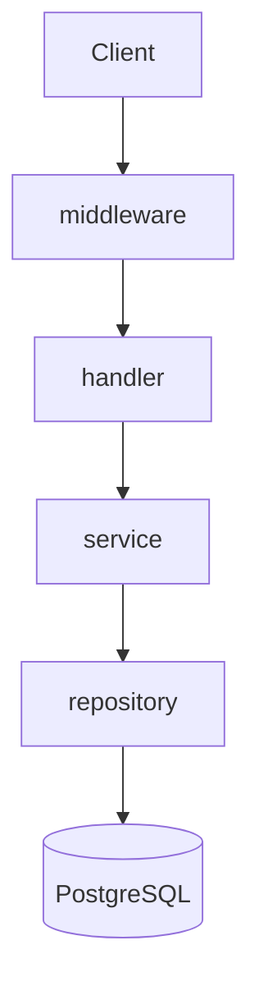
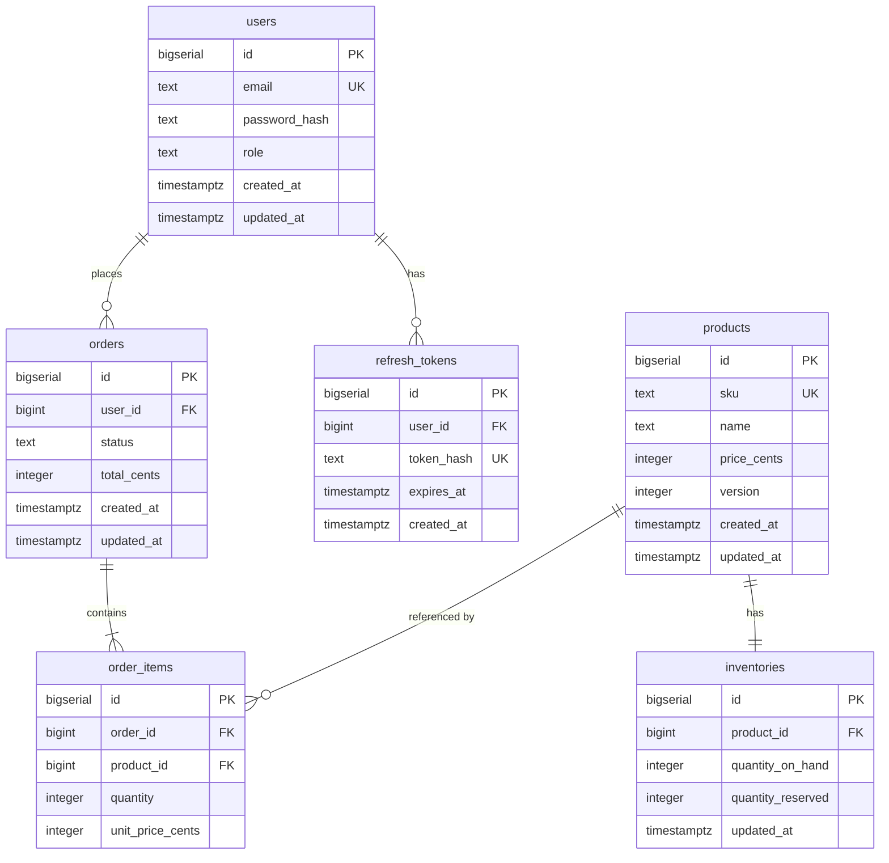
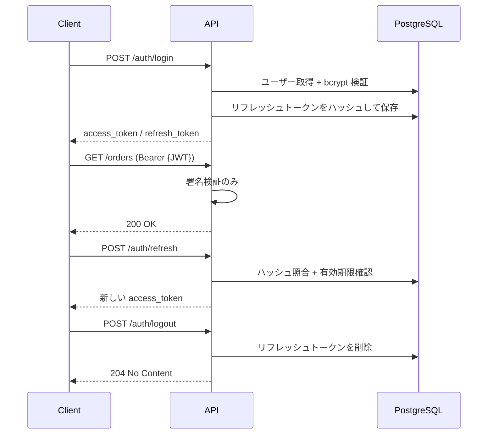

# stockade

在庫・受注管理の JSON API。

並行注文による在庫の過剰販売を防ぐことを主題に、PostgreSQL の排他制御を4段階で実装している。

## 目的

Go・バックエンド設計の学習。

---

## 技術スタック

| 領域 | 選定 |
|---|---|
| 言語 | Go 1.25 |
| DB | PostgreSQL 17 |
| ルーティング | 標準 `net/http`（Go 1.22+ パターンルーティング） |
| マイグレーション | golang-migrate |
| 認証 | JWT + opaque リフレッシュトークン |
| ログ | `log/slog`（JSON 構造化ログ） |
| テスト | `testing` + `go-sqlmock` + `testcontainers-go` |
| 実行環境 | Docker Compose |

Web フレームワーク（gin / echo / chi）は使用していない。

---

## ディレクトリ構成

```
stockade/
├── cmd/
│   └── api/
│       └── main.go              # 組み立てのみ
├── internal/
│   ├── domain/                  # エンティティ、ドメインエラー
│   ├── handler/                 # HTTP層。DTO変換、ステータスマッピング
│   ├── service/                 # ビジネスロジック、トランザクション境界
│   ├── repository/              # SQL実行
│   └── middleware/              # 認証、ログ、recovery、request ID
├── migrations/
├── docker-compose.yml
├── Makefile
└── go.mod
```

---

## アーキテクチャ



| 層 | 責務 |
|---|---|
| middleware | 認証、リクエストログ、panic recovery、request ID |
| handler | リクエストの解釈、DTO 変換、ステータスコードのマッピング |
| service | ビジネスロジック、トランザクション境界 |
| repository | SQL 実行 |
| domain | エンティティ、ドメインエラー（全層から参照される） |

依存は上から下への一方向のみ。`service` は `repository` の interface に依存する。

---

## ER図



| カラム | 値 |
|---|---|
| `users.role` | `customer` / `admin` |
| `orders.status` | `pending` / `shipped` / `cancelled` |

```
販売可能数 = quantity_on_hand - quantity_reserved
```

注文作成時は `quantity_reserved` を増やし、出荷確定時に `quantity_on_hand` を減らす。
キャンセル時は `quantity_reserved` のみ戻す。

---

## 認証



| | アクセストークン | リフレッシュトークン |
|---|---|---|
| 形式 | JWT | opaque（ランダム文字列） |
| 寿命 | 15分 | 7日 |
| 検証 | 署名のみ。DB 不要 | DB 照合 |
| 失効 | できない | レコード削除で即座に可能 |

---

## API エンドポイント

| メソッド | パス | 権限 | 説明 |
|---|---|---|---|
| POST | `/auth/register` | — | ユーザー登録 |
| POST | `/auth/login` | — | ログイン |
| POST | `/auth/refresh` | — | アクセストークン再発行 |
| POST | `/auth/logout` | 認証 | リフレッシュトークン失効 |
| GET | `/products` | — | 商品一覧（販売可能数を含む） |
| GET | `/products/{id}` | — | 商品詳細 |
| POST | `/products` | admin | 商品登録 |
| PATCH | `/products/{id}` | admin | 商品更新 |
| PATCH | `/inventories/{product_id}` | admin | 在庫補充 |
| POST | `/orders` | 認証 | 注文作成（在庫引き当て） |
| GET | `/orders` | 認証 | 自分の注文一覧 |
| GET | `/orders/{id}` | 認証 | 注文詳細 |
| POST | `/orders/{id}/ship` | admin | 出荷確定 |
| POST | `/orders/{id}/cancel` | 認証 | キャンセル |

### エラーレスポンス

| ドメインエラー | ステータス | 発生条件 |
|---|---|---|
| `ErrValidation` | 400 | リクエストの検証失敗 |
| `ErrForbidden` | 403 | 他人のリソースへのアクセス |
| `ErrNotFound` | 404 | リソースが存在しない |
| `ErrInsufficientStock` | 409 | 在庫不足 |
| `ErrVersionConflict` | 409 | 楽観ロック衝突 |
| （その他） | 500 | 内部エラー |

```json
{
  "error": {
    "code": "INSUFFICIENT_STOCK",
    "message": "requested quantity exceeds available stock",
    "details": [{ "product_id": 12, "requested": 5, "available": 2 }]
  }
}
```

内部エラーの詳細はレスポンスに含めず、構造化ログにのみ出力する。

---

## セットアップ

```bash
git clone https://github.com/<user>/stockade.git
cd stockade

cp .env.example .env

docker compose up -d
make migrate-up
make run
```

`http://localhost:8080` で起動する。

---

## テスト

```bash
make test              # ユニットテスト（sqlmock。外部依存なし）
make test-integration  # 統合テスト（testcontainers で実 PostgreSQL を起動）
make test-race         # 競合テスト（-race 付き）
make cover             # カバレッジ
```

sqlmock はドライバ層の偽装であり、実際の行ロックが発生しない。
そのため排他制御の検証には testcontainers を使用し、build tag（`//go:build integration`）で分離している。

---

## 対象外

決済連携 / 配送業者連携 / 返品・返金 / 複数倉庫 / 商品バリエーション /
クーポン・割引ルール / マイクロサービス分割 / イベント駆動 / キャッシュ層

---

## ライセンス

MIT
